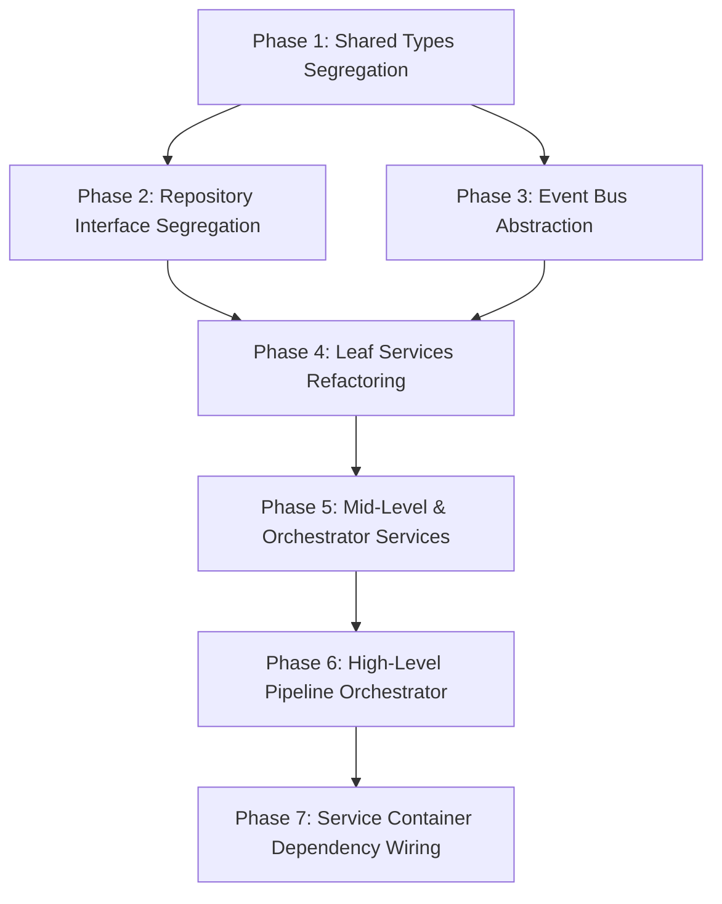

# SOLID Audit and Diagnosis Report

This document contains a comprehensive SOLID audit, diagnosis, and a phase-wise refactoring plan of the top 20 files in the SmartChat backend codebase, ranked by fan-in (most imported files first).

---

## 1. `types.ts`
* **Distinct Responsibilities:**
  1. Declares types for external library integration (Baileys WhatsApp socket wrapper).
  2. Declares DTOs/interfaces for communication with the frontend (EnrichedMessage, ChatListItem).
  3. Declares raw and processed event payloads from the WhatsApp socket (ProtocolResult, BaileysMessage, ChatUpdatePayload).
  4. Declares domain model structures and data persistence shapes (DBMessageWithSender, ProcessedMessage).
  5. Declares utility options structures (MediaSendOptions).
* **SOLID Principle Evaluation:**
  * **S**ingle Responsibility Principle: **VIOLATION**
  * **O**pen/Closed Principle: **PASS**
  * **L**iskov Substitution Principle: **PASS** (Not applicable to types)
  * **I**nterface Segregation Principle: **VIOLATION**
  * **D**ependency Inversion Principle: **PASS**
* **Violations & Proposed Fixes:**
  * **SRP**: The file acts as a dumping ground for all types in the application. Any change in the DB layer, the external provider layer, or the IPC layer causes modifications here.
    * *Proposed Fix:* Split the file into layer-specific files: DTOs in `main/ipc/types.ts` (or `renderer/types.ts`), domain types in `main/domain/types.ts`, and third-party Baileys integrations in `main/services/whatsapp/types.ts`.
  * **ISP**: Clients needing a simple type (e.g. `SocketAccessor`) are forced to import a file containing 20 other heavy database and Baileys types, triggering cascading recompilations.
    * *Proposed Fix:* Segregate types into modular files so that clients only import the files containing the exact definitions they require.
* **Effort Score:** Low

---

## 2. `utils.ts`
* **Distinct Responsibilities:**
  1. Normalizes and cleans WhatsApp JIDs (removing device/agent suffixes).
  2. Parses Baileys timestamps (converting nested/high-low objects to bigint).
  3. Extracts message type from Baileys message payloads.
  4. Extracts full-text searchable content from message objects.
  5. Unwraps nested message containers (ephemeral, view-once, edited).
  6. Generates chat list previews for different message types.
  7. Normalizes group/community metadata from chat updates.
* **SOLID Principle Evaluation:**
  * **S**ingle Responsibility Principle: **VIOLATION**
  * **O**pen/Closed Principle: **VIOLATION**
  * **L**iskov Substitution Principle: **PASS** (Not applicable)
  * **I**nterface Segregation Principle: **PASS**
  * **D**ependency Inversion Principle: **VIOLATION**
* **Violations & Proposed Fixes:**
  * **SRP**: The file contains procedural logic for JIDs, timestamps, message content unwrapping, community structures, and presentation labels.
    * *Proposed Fix:* Extract JID helpers into `jid.ts`, timestamp helpers into `time.ts`, and Baileys-specific message parsing/unwrapping into a message parser class or sub-module.
  * **OCP**: The methods `getMessageType`, `extractTextContent`, and `unwrapMessage` are closed to extension. Adding new message types or containers requires editing hardcoded arrays and switch-like logic inside these methods.
    * *Proposed Fix:* Introduce a registry pattern or strategy pattern where individual message types define how they unwrap themselves and extract text.
  * **DIP**: High-level modules couple directly to these concrete static utility functions, making mocking and testing hard.
    * *Proposed Fix:* Inject helper services via the Service Container using interfaces (e.g., `IJidNormalizer`, `IMessageUnwrapper`).
* **Effort Score:** Medium

---

## 3. `services/contacts/ContactService.ts`
* **Distinct Responsibilities:**
  1. Caches identity IDs, meJids, and LID/PN links.
  2. Manages logged-in user identification and registration.
  3. Resolves names (single and batch) from JIDs via `ContactNameResolver`.
  4. Manages contact identity upserts and identity mappings in the DB.
  5. Links LIDs and PNs explicitly via `LidPnLinker`.
* **SOLID Principle Evaluation:**
  * **S**ingle Responsibility Principle: **VIOLATION**
  * **O**pen/Closed Principle: **VIOLATION**
  * **L**iskov Substitution Principle: **PASS**
  * **I**nterface Segregation Principle: **PASS** (No interface exists to violate, but lack of an interface is a smell)
  * **D**ependency Inversion Principle: **VIOLATION**
* **Violations & Proposed Fixes:**
  * **SRP**: Manages cache lifecycle, coordinates user registration, formats display names, and orchestrates database transactions for mapping identities.
    * *Proposed Fix:* Extract in-memory state caching to an independent cache class. Separate query responsibilities (`ContactQueryService`) from write synchronization operations (`ContactWriteService`).
  * **OCP**: In `upsertContact`, a conditional block parses specific JID domains (`@s.whatsapp.net`, `@lid`, `@g.us`, `@bot`). Adding new JID classes requires modifying this service class.
    * *Proposed Fix:* Use a parser strategy pattern to delegate specific alias creation logic based on JID patterns.
  * **DIP**: Depends on concrete implementations of `LidPnLinker` and `ContactNameResolver`. Exposes a concrete class to the service container rather than an interface.
    * *Proposed Fix:* Define `IContactService` and depend on interfaces for its collaborators (`ILidPnLinker`, `IContactNameResolver`).
* **Effort Score:** Medium

---

## 4. `services/whatsapp/WAEventBus.ts`
* **Distinct Responsibilities:**
  1. Registers event handlers for typed events.
  2. Emits events and executes async handlers synchronously/sequentially in registration order.
  3. Manages listener limits and removes listeners.
* **SOLID Principle Evaluation:**
  * **S**ingle Responsibility Principle: **PASS**
  * **O**pen/Closed Principle: **PASS**
  * **L**iskov Substitution Principle: **PASS**
  * **I**nterface Segregation Principle: **VIOLATION** (Minor)
  * **D**ependency Inversion Principle: **VIOLATION**
* **Violations & Proposed Fixes:**
  * **ISP / DIP**: The event bus does not implement an interface, forcing all event-driven services to depend on the concrete `WAEventBus` class.
    * *Proposed Fix:* Extract `IWAEventBus` interface (and possibly split it into `IEventPublisher` and `IEventSubscriber` to restrict client access permissions).
* **Effort Score:** Low

---

## 5. `services/chats/IChatRepository.ts` (Interface)
* **Distinct Responsibilities:**
  1. Defines data contracts for Chat queries and mutations.
  2. Defines data contracts for Community creations and mutations.
  3. Defines data contracts for Chat Member queries and mutations.
* **SOLID Principle Evaluation:**
  * **S**ingle Responsibility Principle: **PASS**
  * **O**pen/Closed Principle: **PASS**
  * **L**iskov Substitution Principle: **PASS**
  * **I**nterface Segregation Principle: **VIOLATION**
  * **D**ependency Inversion Principle: **PASS**
* **Violations & Proposed Fixes:**
  * **ISP**: The interface groups chat, community, and chat member DB operations together. A class only querying chat member roles is forced to import and depend on community write operations.
    * *Proposed Fix:* Split the repository interface into three segregated interfaces: `IChatRepository`, `ICommunityRepository`, and `IChatMemberRepository`.
* **Effort Score:** Low

---

## 6. `services/contacts/IContactRepository.ts` (Interface)
* **Distinct Responsibilities:**
  1. Defines DB contract for user Identity management (create/update/delete).
  2. Defines DB contract for Identity aliases.
  3. Defines DB contract for LID-to-PN maps.
* **SOLID Principle Evaluation:**
  * **S**ingle Responsibility Principle: **PASS**
  * **O**pen/Closed Principle: **PASS**
  * **L**iskov Substitution Principle: **PASS**
  * **I**nterface Segregation Principle: **VIOLATION**
  * **D**ependency Inversion Principle: **PASS**
* **Violations & Proposed Fixes:**
  * **ISP**: Combines identity lookups, alias configurations, reference counters, and PN-to-LID mappings.
    * *Proposed Fix:* Split into segregated interfaces: `IIdentityRepository`, `IAliasRepository`, and `ILidMapRepository`.
* **Effort Score:** Low

---

## 7. `services/ai/AIToolService.ts`
* **Distinct Responsibilities:**
  1. Manages a registry of executable tools.
  2. Generates system instructions, format guidelines, and LLM roles.
  3. Controls ReAct and standard prompt protocols.
* **SOLID Principle Evaluation:**
  * **S**ingle Responsibility Principle: **VIOLATION**
  * **O**pen/Closed Principle: **VIOLATION**
  * **L**iskov Substitution Principle: **PASS**
  * **I**nterface Segregation Principle: **PASS**
  * **D**ependency Inversion Principle: **VIOLATION**
* **Violations & Proposed Fixes:**
  * **SRP**: The class registers tools and holds a massive, hardcoded markdown template representing system roles, formatting guidelines, and protocols.
    * *Proposed Fix:* Extract the prompt templates and formatting strings to a separate `SystemPromptBuilder` class.
  * **OCP**: System instruction configurations (such as user phone number, LID, and local time) are hardcoded or statically evaluated. Adding new prompt styles (e.g., for different model targets) requires rewriting internal methods.
    * *Proposed Fix:* Parameterize the system instructions and inject settings metadata dynamically.
  * **DIP**: High-level modules couple directly to the exported concrete singleton `toolRegistry`.
    * *Proposed Fix:* Expose the registry via an `IToolRegistry` interface and register it in the `ServiceContainer`.
* **Effort Score:** Medium

---

## 8. `services/messages/formatters/MessageFormatter.ts` (Interface)
* **Distinct Responsibilities:**
  1. Defines a contract for message format support checks (`supports`).
  2. Defines a contract for formatting a message to a string based on context (`format`).
* **SOLID Principle Evaluation:**
  * **S**ingle Responsibility Principle: **PASS**
  * **O**pen/Closed Principle: **PASS**
  * **L**iskov Substitution Principle: **PASS**
  * **I**nterface Segregation Principle: **PASS**
  * **D**ependency Inversion Principle: **PASS**
* **Violations & Proposed Fixes:**
  * None (Highly cohesive, modular, and follows DIP).
* **Effort Score:** Low (No fixes needed)

---

## 9. `services/messages/IMessageQueryRepository.ts` (Interface)
* **Distinct Responsibilities:**
  1. Defines query contract for individual and batched messages.
  2. Defines query contract for vector similarity matches (semantic search).
  3. Defines query contract for raw SQL execution and query ids.
* **SOLID Principle Evaluation:**
  * **S**ingle Responsibility Principle: **PASS**
  * **O**pen/Closed Principle: **PASS**
  * **L**iskov Substitution Principle: **PASS**
  * **I**nterface Segregation Principle: **VIOLATION**
  * **D**ependency Inversion Principle: **PASS**
* **Violations & Proposed Fixes:**
  * **ISP**: Combines basic message fetching, advanced full-text and vector search matching, and raw SQL utility queries.
    * *Proposed Fix:* Split the query contracts into `IMessageQueryRepository` (for standard queries) and `IMessageVectorRepository` (for vector search queries).
* **Effort Score:** Low

---

## 10. `services/messages/IMessageRepository.ts` (Interface)
* **Distinct Responsibilities:**
  1. Defines database transaction contracts for inserting, editing, and updating messages.
* **SOLID Principle Evaluation:**
  * **S**ingle Responsibility Principle: **PASS**
  * **O**pen/Closed Principle: **PASS**
  * **L**iskov Substitution Principle: **PASS**
  * **I**nterface Segregation Principle: **PASS** (Correctly segregates writes from reads, following Command-Query Separation)
  * **D**ependency Inversion Principle: **PASS**
* **Violations & Proposed Fixes:**
  * None.
* **Effort Score:** Low (No fixes needed)

---

## 11. `services/messages/IReactionRepository.ts` (Interface)
* **Distinct Responsibilities:**
  1. Defines contract for saving, deleting, and querying message reactions.
* **SOLID Principle Evaluation:**
  * **S**ingle Responsibility Principle: **PASS**
  * **O**pen/Closed Principle: **PASS**
  * **L**iskov Substitution Principle: **PASS**
  * **I**nterface Segregation Principle: **PASS**
  * **D**ependency Inversion Principle: **PASS**
* **Violations & Proposed Fixes:**
  * None.
* **Effort Score:** Low (No fixes needed)

---

## 12. `services/messages/MessageService.ts`
* **Distinct Responsibilities:**
  1. Coordinates the incoming message parsing, identity extraction, and database persistence pipeline.
  2. Routes protocol messages (revokes/edits).
  3. Synchronously parses raw message structures (delegates to parser).
  4. Coordinates bulk historical message ingestion.
  5. Orchestrates chat message retrievals and UI display-name enrichment.
  6. Coordinates reaction updates and processes metadata links.
  7. Generates safe and sanitized media filenames.
* **SOLID Principle Evaluation:**
  * **S**ingle Responsibility Principle: **VIOLATION**
  * **O**pen/Closed Principle: **VIOLATION**
  * **L**iskov Substitution Principle: **PASS**
  * **I**nterface Segregation Principle: **VIOLATION** (Minor smell - no interface)
  * **D**ependency Inversion Principle: **VIOLATION**
* **Violations & Proposed Fixes:**
  * **SRP**: The service coordinates the entire business pipeline and also implements concrete parsing details, JID manipulations, event bus payloads, and media hashing calculations.
    * *Proposed Fix:* Extract JID/LID mapping side effects into an `IdentityReconciliationService`. Extract file naming logic into a `MediaStorageHelper`. Split the service into a query component (`MessageQueryService`) and ingestion component (`MessageIngestionService`).
  * **OCP**: Checking specific message types (like `reactionMessage`, `protocolMessage`, secret messages) is hardcoded inside the pipeline. Supporting new protocol events forces updates inside this service.
    * *Proposed Fix:* Implement a chain-of-responsibility or message handler strategy pattern to process different types of messages independently.
  * **DIP**: Depends on concrete service implementations like `ContactService`, `EmbeddingService`, `SecretMessageService`, and `MessageParser` rather than abstractions.
    * *Proposed Fix:* Introduce interfaces for all services and inject them via the `ServiceContainer`.
* **Effort Score:** High

---

## 13. `services/whatsapp/WAEventTypes.ts`
* **Distinct Responsibilities:**
  1. Declares types for individual events fired on the WAEventBus.
  2. Declares the master `WAEventMap` matching event keys to types.
* **SOLID Principle Evaluation:**
  * **S**ingle Responsibility Principle: **VIOLATION**
  * **O**pen/Closed Principle: **PASS**
  * **L**iskov Substitution Principle: **PASS** (Not applicable)
  * **I**nterface Segregation Principle: **VIOLATION**
  * **D**ependency Inversion Principle: **PASS**
* **Violations & Proposed Fixes:**
  * **SRP / ISP**: A single file contains all events in the system. Changing any event signature invalidates cache for all event subscribers.
    * *Proposed Fix:* Split into sub-files (e.g. `messageEvents.ts`, `chatEvents.ts`, `contactEvents.ts`) and merge them into the master map.
* **Effort Score:** Low

---

## 14. `services/whatsapp/subscribers/IWAEventSubscriber.ts` (Interface)
* **Distinct Responsibilities:**
  1. Defines registration contract for event subscribers.
  2. Defines disposal/teardown contract.
* **SOLID Principle Evaluation:**
  * **S**ingle Responsibility Principle: **PASS**
  * **O**pen/Closed Principle: **PASS**
  * **L**iskov Substitution Principle: **PASS**
  * **I**nterface Segregation Principle: **PASS**
  * **D**ependency Inversion Principle: **VIOLATION** (Minor)
* **Violations & Proposed Fixes:**
  * **DIP**: The signature `register(bus: WAEventBus)` depends directly on the concrete `WAEventBus` class rather than an interface.
    * *Proposed Fix:* Change the parameter type to an interface (e.g. `IWAEventBus` or `IEventSubscriber`).
* **Effort Score:** Low

---

## 15. `services/chats/ChatService.ts`
* **Distinct Responsibilities:**
  1. Normalizes chat payloads and coordinates database upsert.
  2. Synchronizes community updates and linked parent channels.
  3. Increments/clears unread counts and queries mute statuses.
  4. Parses, links, and synchronizes group participants (identities, roles).
* **SOLID Principle Evaluation:**
  * **S**ingle Responsibility Principle: **VIOLATION**
  * **O**pen/Closed Principle: **PASS**
  * **L**iskov Substitution Principle: **PASS**
  * **I**nterface Segregation Principle: **VIOLATION** (Minor smell)
  * **D**ependency Inversion Principle: **VIOLATION**
* **Violations & Proposed Fixes:**
  * **SRP**: Combines chat configurations (muted, unread, archived) with group membership operations (identity linkage, participant database routing).
    * *Proposed Fix:* Extract participant syncing into a dedicated `GroupMembershipService` or coordinate it inside the `ContactService`.
  * **DIP**: Couples to concrete `ContactService` and `ChatListEnricher`.
    * *Proposed Fix:* Implement and depend on `IContactService` and `IChatListEnricher` interfaces.
* **Effort Score:** Medium

---

## 16. `services/search/EmbeddingService.ts`
* **Distinct Responsibilities:**
  1. Manages life cycle, configuration, and messaging for background `Worker` threads.
  2. Manages a message indexing queue and processes it asynchronously.
  3. Performs database vector upserts and synchronization queries.
* **SOLID Principle Evaluation:**
  * **S**ingle Responsibility Principle: **VIOLATION**
  * **O**pen/Closed Principle: **PASS**
  * **L**iskov Substitution Principle: **PASS**
  * **I**nterface Segregation Principle: **PASS**
  * **D**ependency Inversion Principle: **VIOLATION**
* **Violations & Proposed Fixes:**
  * **SRP**: The service manages worker resources/job queues *and* acts as a repository executing direct Prisma CRUD operations.
    * *Proposed Fix:* Delegate database storage logic to a repository implementation (e.g., `IMessageVectorRepository`), leaving `EmbeddingService` focused only on queue and worker lifecycle.
  * **DIP**: Directly depends on concrete `PrismaClient` rather than a repository abstraction, and executes raw SQL queries within business methods.
    * *Proposed Fix:* Inject a repository interface instead of `PrismaClient`.
* **Effort Score:** Medium

---

## 17. `services/whatsapp/ReceiptService.ts`
* **Distinct Responsibilities:**
  1. Maps Baileys technical delivery codes to domain status strings.
  2. Coordinates single-recipient message status transitions.
  3. Resolves and tracks group receipt counts (read/delivered counts).
  4. Fetches and resolves contact display names for message receipts.
* **SOLID Principle Evaluation:**
  * **S**ingle Responsibility Principle: **VIOLATION**
  * **O**pen/Closed Principle: **PASS**
  * **L**iskov Substitution Principle: **PASS**
  * **I**nterface Segregation Principle: **PASS**
  * **D**ependency Inversion Principle: **VIOLATION**
* **Violations & Proposed Fixes:**
  * **SRP**: Integrates technical status mapping rules, database queries, and direct event emissions.
    * *Proposed Fix:* Delegate database lookups/updates to a repository and event bus updates to a status publisher.
  * **DIP**: Couples directly to concrete `PrismaClient` and `ContactService`.
    * *Proposed Fix:* Inject repository and contact service interfaces instead of concrete classes.
* **Effort Score:** Medium

---

## 18. `ServiceContainer.ts`
* **Distinct Responsibilities:**
  1. Creates, instantiates, and wires together all repository instances.
  2. Creates, instantiates, and wires together all service instances.
  3. Exposes the master dependencies registry object.
* **SOLID Principle Evaluation:**
  * **S**ingle Responsibility Principle: **PASS**
  * **O**pen/Closed Principle: **VIOLATION**
  * **L**iskov Substitution Principle: **PASS**
  * **I**nterface Segregation Principle: **PASS**
  * **D**ependency Inversion Principle: **VIOLATION**
* **Violations & Proposed Fixes:**
  * **OCP**: Adding a new service forces developers to modify both `createServices` instantiation logic and `ServiceContainer` type definition.
    * *Proposed Fix:* Introduce an automated DI Container framework (e.g., TSyringe or InversifyJS) to support declarative/dynamic registration.
  * **DIP**: The container type maps to concrete classes (`ContactService`, `MessageService`) rather than abstractions, causing dependent code to bind to concrete classes.
    * *Proposed Fix:* Update `ServiceContainer` mapping keys to point to interface types (`IContactService`, `IMessageService`).
* **Effort Score:** Low / Medium

---

## 19. `services/ai/providers/Provider.ts` (Interface)
* **Distinct Responsibilities:**
  1. Defines technical contract for AI providers (Gemini, LM Studio, etc.).
* **SOLID Principle Evaluation:**
  * **S**ingle Responsibility Principle: **PASS**
  * **O**pen/Closed Principle: **PASS**
  * **L**iskov Substitution Principle: **PASS**
  * **I**nterface Segregation Principle: **PASS**
  * **D**ependency Inversion Principle: **PASS**
* **Violations & Proposed Fixes:**
  * None.
* **Effort Score:** Low (No fixes needed)

---

## 20. `services/ai/AIKeyService.ts`
* **Distinct Responsibilities:**
  1. Holds hardcoded fallback API keys for AI providers.
  2. Resolves keys based on environmental variables.
  3. Reads, parses, and writes local JSON configurations to the user data path.
* **SOLID Principle Evaluation:**
  * **S**ingle Responsibility Principle: **VIOLATION**
  * **O**pen/Closed Principle: **VIOLATION**
  * **L**iskov Substitution Principle: **PASS**
  * **I**nterface Segregation Principle: **VIOLATION** (Smell - no interface)
  * **D**ependency Inversion Principle: **VIOLATION**
* **Violations & Proposed Fixes:**
  * **SRP**: Performs environmental lookups, file systems operations (`fs.readFileSync`), and memory state management in a single class.
    * *Proposed Fix:* Move file operations into a filesystem key-storage provider.
  * **OCP**: Keys and provider names are hardcoded. Adding a provider requires modifying the class structure and its static fields.
    * *Proposed Fix:* Expose settings dynamically using provider config arrays/mappings.
  * **DIP**: Exposes a global singleton instance (`export const aiKeyService = new AIKeyService();`) and is imported directly by LLM providers, bypassing the Service Container.
    * *Proposed Fix:* Add an `IAIKeyService` interface, register it in the container, and inject it into the AI service layer.
* **Effort Score:** Low / Medium

---

# Phase-Wise Refactoring Plan

This refactoring path follows strict structural dependencies. Fixing lower layers first guarantees that downstream orchestrating layers do not import broken dependencies or compile against stale abstractions.

### Phase 1: Shared Types Segregation (Layer 1) [COMPLETED]
* **Target Files:** `types.ts`, `WAEventTypes.ts`
* **Objective:** Remove the high fan-in single-point-of-failure types files.
* **Actions:**
  1. Split `types.ts` into layer-specific subsets: `main/ipc/types.ts` (IPC/DTO structures), `main/domain/types.ts` (Core entities), and `main/services/whatsapp/types.ts` (Baileys/socket specific types). [DONE]
  2. Split `WAEventTypes.ts` into modular domain event structures (e.g. `messageEvents.ts`, `chatEvents.ts`, `contactEvents.ts`, `groupEvents.ts`, `syncEvents.ts`, `miscEvents.ts`) and import them into a unified, consolidated types index. [DONE]
  3. Re-route codebase-wide imports to import only the specific types files. [DONE]
  4. Delete the empty monolithic `src/main/types.ts`. [DONE]
  5. Run TypeScript compiler and Jest/Vitest test suites to verify compilation and runtime correctness. [DONE]

### Phase 2: Database Repository Interface Segregation (Layer 2 - Part 1) [DONE]
* **Target Files:** `IChatRepository.ts`, `IContactRepository`, `IMessageQueryRepository`
* **Objective:** Segregate database read/write contracts to satisfy the Interface Segregation Principle (ISP).
* **Actions:**
  1. Split `IContactRepository` into `IIdentityRepository` (identity CRUD), `IAliasRepository` (alias CRUD), and `ILidMapRepository` (PN/LID mapping). [DONE]
  2. Split `IChatRepository` into `IChatRepository` (chat configurations) and `ICommunityRepository` (community mappings). [DONE]
  3. Split `IMessageQueryRepository` into `IMessageQueryRepository` (standard reading) and `IMessageVectorRepository` (vector/semantic searches). [DONE]
  4. Ensure concrete repository implementations in the codebase are split accordingly. [DONE]

### Phase 3: Core Event Infrastructure (Layer 2 - Part 2) [DONE]
* **Target Files:** `WAEventBus.ts`, `IWAEventSubscriber.ts`
* **Objective:** Decouple event-subscribing clients from the concrete Event Bus implementation.
* **Actions:**
  1. Extract an `IWAEventBus` interface (declaring `on`, `off`, `emit`, `removeAllListeners`). [DONE]
  2. Update `IWAEventSubscriber`'s `register(bus)` method to depend on the `IWAEventBus` interface instead of the concrete `WAEventBus` class. [DONE]
  3. Wire the concrete event bus to the interface in the Service Container. [DONE]

### Phase 4: Leaf Services Refactoring (Layer 3) [DONE]
* **Target Files:** `AIKeyService.ts`, `EmbeddingService.ts`, `ReceiptService.ts`
* **Objective:** Decouple leaf business services from direct filesystem access and database clients.
* **Actions:**
  1. **AIKeyService:** Extract an `IKeyStorage` interface for saving/reading config keys. Implement filesystem storage in a separate class. Define an `IAIKeyService` interface, remove the global concrete singleton, and register it in the container. [DONE]
  2. **EmbeddingService:** Extract an `IMessageVectorRepository` interface. Inject it into `EmbeddingService` instead of having the service interact directly with `PrismaClient` and execute raw SQL. [DONE]
  3. **ReceiptService:** Inject an `IReceiptRepository` (or partitioned message repository) to execute database queries. Inject `IWAEventBus` for updates. [DONE]

### Phase 5: Mid-Level Services & Orchestrators Refactoring (Layer 4 - Part 1) [COMPLETED]
* **Target Files:** `ChatService.ts`, `ContactService.ts`, `AIToolService.ts`
* **Objective:** Refactor low-to-mid level coordinators to delegate specialized side-effects and satisfy OCP.
* **Actions:**
  1. **ContactService:** Define `IContactService`. Extract LID-to-PN mapping transactions into a helper. Implement a strategy registry in `upsertContact` to process different JID alias formats (avoiding suffix string checking). [DONE]
  2. **ChatService:** Define `IChatService`. Extract group participant syncing into a dedicated `GroupMembershipService` (or coordinate inside `ContactService`), removing raw metadata-linking operations from chat management. [DONE]
  3. **AIToolService:** Define `IToolRegistry`. Extract the hardcoded system prompt template and strings into a `SystemPromptBuilder` class. Inject user details at runtime rather than relying on hardcoded static strings. [DONE]

### Phase 6: High-Level Pipeline Orchestrator (Layer 4 - Part 2)
* **Target Files:** `MessageService.ts`
* **Objective:** Refactor the codebase's main message orchestration pipeline.
* **Actions:**
  1. Define `IMessageService` (or divide into `IMessageWriterService` and `IMessageQueryService` to follow CQRS).
  2. Delegate technical formatting and file-naming logic (`getSafeMediaFileName`) to a specialized helper.
  3. Extract LID↔PN reconciliation logic to `IdentityReconciliationService`.
  4. Implement a message processor pipeline strategy to handle protocol messages, reaction messages, and standard messages dynamically (avoiding manual type checking inside `processMessage`).

### Phase 7: Service Container Dependency Wiring (Layer 5)
* **Target Files:** `ServiceContainer.ts`
* **Objective:** Bind all services and repositories together via interface definitions.
* **Actions:**
  1. Update `ServiceContainer` type definitions to map keys strictly to interface types (e.g. `chatRepository: IChatRepository` instead of concrete class types).
  2. Update the `createServices` function to wire classes to their corresponding interfaces.
  3. Ensure all external services (e.g. IPC handlers, workers) consume the container through interfaces.
