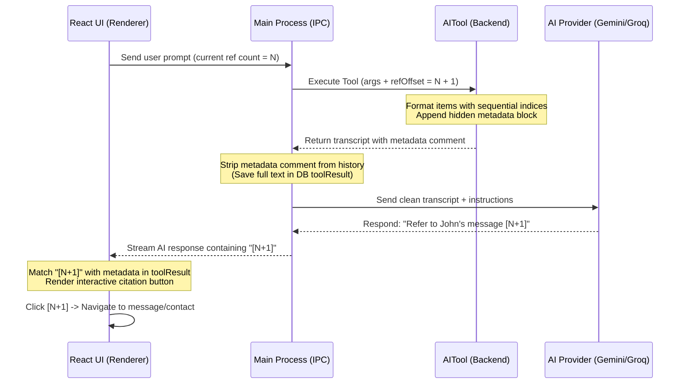

# Unified Entity Citation Design

This document details the architectural design for introducing **polymorphic entity citations** in SmartChat. This feature allows the AI to reference specific messages, contacts, files, or chats using clickable, interactive footnotes (e.g. `[1]`, `[2]`), while maintaining maximum token efficiency and zero hallucination risk.

---

## 1. Problem Statement & Constraints

1. **Click-to-Navigate:** The user needs to click on items in the AI's response and navigate to that specific message in the chat screen, view a contact's profile, or open a file.
2. **Token Efficiency:** Raw identifiers (like WhatsApp message IDs or JIDs) are token-heavy to read in the context window and extremely expensive/slow to output.
3. **No Hallucinations:** LLMs are highly prone to slightly mangling or hallucinating long alphanumeric hex strings when writing markdown links.
4. **Collision Prevention:** If multiple tools are called, or if there are multiple turns in a session, indices like `[1]` must not collide or overlap.
5. **Extensibility:** The referencing design must easily scale to new tools and entity types (e.g. referencing files, contacts, search results) without altering the core prompt strategies or AI parsing pipelines.

---

## 2. Architectural Solution

The design splits responsibilities across the application layers, keeping the LLM entirely unaware of the actual database IDs, while the UI resolves citations dynamically using local metadata:



---

## 3. Data Flow & Interface Specifications

### 3.1 Tool Schema Extensibility (`IToolRegistry`)
Every tool that supports citation references accepts two optional parameters:
* `includeReferences` (`boolean`): Opt-in flag to append indices and metadata.
* `refOffset` (`number`): The starting index for sequential citation numbers.

### 3.2 Polymorphic Reference Schema
The mapping metadata is represented by a polymorphic reference structure mapping a citation index to a target destination:

| Entity Type | Required Fields | Destination Action |
|---|---|---|
| **`message`** | `chatJid`, `messageId` | Navigates to that specific message in the chat screen |
| **`chat`** | `chatJid` | Opens the main message thread of the specified chat |
| **`contact`** | `jid` | Opens the contact's profile modal or direct thread |
| **`file`** | `filePath` | Opens a local preview or triggers a file download |

### 3.3 Tool Output Formatting
When references are enabled, the tool outputs:
1. Human-readable text with sequential numbers (e.g. `[1]`, `[2]`).
2. An HTML comment containing the JSON-serialized mapping dictionary at the end of the text.

Example formatting structure:
```markdown
=== Transcript ===
  - [4] Them: Did you find the syllabus?
  - [5] Me: Yes, sending it now.

<!-- References:
{
  "4": { "type": "message", "chatJid": "919931386969@s.whatsapp.net", "messageId": "3EB0123" },
  "5": { "type": "message", "chatJid": "919931386969@s.whatsapp.net", "messageId": "3EB0124" }
}
-->
```

---

## 4. Layer Responsibilities

### 4.1 Tool Runner / Backend
* Accepts `includeReferences` and `refOffset` arguments.
* Generates continuous indexes starting from the specified offset.
* Serializes mappings in the trailing HTML comment.

### 4.2 Main Process (AI Service)
* **Token Saving Hook:** Parses the raw system message and strips out the HTML comment containing references prior to sending the history messages to the LLM. This saves thousands of tokens on large context reads.
* **Instruction Builder:** Instructs the LLM generally to append source indexes in brackets (e.g., `[4]`) in its conversational responses.

### 4.3 Frontend Renderer
* **Offset Manager:** Scans the local session message history to determine the maximum index currently in use, passing this as `refOffset` to subsequent tool executions.
* **Citations Parser:** Matches `[N]` references in markdown responses, looks up the corresponding reference block in the session’s local history, and renders them as clickable footnote pills.
* **Polymorphic Action Handler:** Triggers the appropriate routing, profile display, or preview action based on the clicked entity's `type`.

---

## 5. Architectural Benefits

1. **Decoupled Extensions (OCP):** Introducing a new entity type only requires updating the React click handler. Backend tools do not need to coordinate with other components.
2. **Hallucination Immunity:** Since the LLM is only instructed to output a number (e.g. `[1]`), it cannot hallucinate invalid UUIDs or wrong paths.
3. **Absolute Token Minimization:** The long database keys and JID mappings are preserved locally in the IPC/Renderer state database and stripped from the LLM prompt. The input overhead is 0 tokens, and the output overhead is only 3 tokens per citation.
4. **Context Cleanliness:** In non-UI pipelines (e.g., CLI automation or batch exports), tools can run with `includeReferences: false`, producing raw, clean text transcripts without indices or HTML comments.
