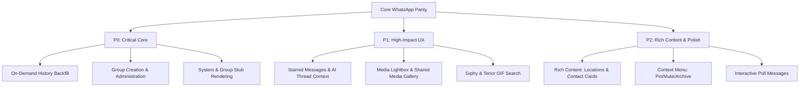

# SmartChat Feature Prioritization Roadmap

This document analyzes the remaining features needed for the **smartChat** WhatsApp client clone to reach standard WhatsApp parity while leveraging its unique AI-enhanced architecture.

---

## 📊 Priority Matrix Summary

| Feature | Priority | Parity Value | AI Synergy | Technical Complexity |
| :--- | :---: | :---: | :---: | :---: |
| **On-Demand History Backfill** | **P0** | 🔴 Critical | 🟡 Medium | 🔴 High (Baileys Querying) |
| **Group Creation & Admin Tools**| **P0** | 🔴 Critical | 🟢 High | 🟡 Medium (IPC + UI) |
| **System Stubs / Event Rendering**| **P0** | 🔴 Critical | ⚪ Low | 🟢 Low (Renderer CSS) |
| **Starred Messages & AI Context** | **P1** | 🟡 High | 🔴 Critical | 🟢 Low (DB Query + Context) |
| **Media Lightbox & Gallery** | **P1** | 🟡 High | ⚪ Low | 🟡 Medium (React Slider) |
| **Giphy & Tenor GIF Integration** | **P1** | 🟡 High | ⚪ Low | 🟢 Low (API fetch) |
| **Location Sharing & Contact Cards**| **P2** | 🟢 Medium | 🟢 High | 🟡 Medium (Leaflet + VCard) |
| **Context Menu (Pin/Mute/Archive)**| **P2** | 🟢 Medium | ⚪ Low | 🟢 Low (React state) |
| **Poll Messages (Create & Update)**| **P2** | 🟢 Medium | 🟡 Medium | 🔴 High (Decryption keys) |
| **Status (Stories)** | **P3** | ⚪ Low | ⚪ Low | 🔴 High (Mobile parity only) |

---

## 🔴 Tier 0: Critical Core Experience (P0)

These features address basic chat expectations. Without them, the app feels like a static database viewer rather than an interactive chat client.

### 1. On-Demand History Backfill (Scroll-Up Sync)
* **What's Missing**: Currently, `loadMore` queries page-by-page from the local SQLite database. If the local database doesn't have older messages (because they haven't been synced from the phone), scrolling up stops.
* **Requirements**:
  * Implement an IPC handler that triggers a Baileys query to fetch historical messages from the phone for a specific JID, anchoring at the oldest message timestamp.
  * Integrate this handler into the frontend's `loadMore` hook in `useMessages.ts` when local history is exhausted.
* **Why it's first priority**: Users need to see previous conversations when searching or reviewing context. The AI assistant also needs this historical message log to build proper thread context.

### 2. Group Creation & Administration
* **What's Missing**: The interface allows viewing groups, but group creation and admin management (adding/removing participants, promoting/demoting admins, updating group info) are missing.
* **Requirements**:
  * Add a "New Group" wizard in the chat list.
  * Implement context actions on group participant lists (Promote/Demote/Remove).
  * Expose `@whiskeysockets/baileys` socket calls (`groupCreate`, `groupParticipantsUpdate`, `groupUpdateSubject/Description`) via IPC.

### 3. System Stubs & Group Event Rendering
* **What's Missing**: Background events (e.g., missed calls, participant joins, name changes) show up as empty or unhandled/ciphertext bubbles.
* **Requirements**:
  * Follow the [WhatsApp System Stubs Guide](file:///c:/Users/prith/Desktop/smartChat/to-dos/whatsapp_stubs_guide.md) to parse stubs into a `system` message type.
  * Render a clean, centered system notification bubble in `MessageItem.tsx` rather than a standard speech bubble.
* **Why it's first priority**: Prevents user confusion by explaining why a message bubble is empty and displays critical group updates.

---

## 🟡 Tier 1: High-Impact UX & AI Synergy (P1)

These features bridge the gap between a basic chat app and a modern, high-fidelity experience, with direct integrations into SmartChat's intelligence.

### 1. Starred Messages (with AI Context Pinning)
* **What's Missing**: The capability to "Star" messages and access a dedicated "Starred Messages" sidebar.
* **AI Synergy (Critical)**:
  * In addition to acting as a standard bookmarking system, **starred messages can act as explicit prompt-anchors/instructions for the AI Chat Sidebar**.
  * When the user opens the AI Assistant, the AI can read starred messages from that chat to respect custom constraints, project rules, or key facts without needing full history retrieval.
* **Requirements**:
  * Add a `isStarred` boolean column in the message database table.
  * Add a "Star" option to the message dropdown menu.
  * Add a "Starred Messages" view inside the sidebar or chat search overlay.

### 2. Full-Screen Media Lightbox & Shared Media Gallery
* **What's Missing**: Right-clicking or clicking an image/video doesn't open a lightbox; there is no panel to view all media, links, or documents shared in a chat.
* **Requirements**:
  * Build a React full-screen media viewer (`Lightbox`) with pinch-to-zoom, keyboard navigation (left/right arrow keys), and save options.
  * Create a "Media, Links, and Docs" tab inside the Chat Info overlay.

### 3. Giphy & Tenor GIF Picker Integration
* **What's Missing**: The GIF tab in `EmojiStickerGifPicker.tsx` is implemented but requires Giphy API key configuration.
* **Requirements**:
  * Refine Giphy fallback handling.
  * Ensure Giphy sticker/GIF conversion to `.mp4` and `.webp` complies with Baileys' media processing limits.

---

## 🟢 Tier 2: Rich Content & Polish (P2)

### 1. Rich Content: Location Sharing & Contact Cards (VCards)
* **What's Missing**: Receiving location coordinates or vCards yields raw JSON or fallback text.
* **AI Synergy**: The AI can parse contact vCards or locations to help the user schedule events, email contacts, or search addresses.
* **Requirements**:
  * Parse `locationMessage` and render a mini map preview (using static map URLs or a lightweight Leaflet viewer).
  * Parse `contactMessage` (vCard) and render a custom contact card with "Add Contact" or "Message" action buttons.

### 2. Chat List Context Menu (Pin/Mute/Archive)
* **What's Missing**: Chat list manipulation.
* **Requirements**:
  * Implement a custom right-click context menu on `ChatList` items to toggle pin status, mute notifications, or archive chats.

### 3. Interactive Poll Messages
* **What's Missing**: Baileys poll creation and update message support.
* **Requirements**:
  * Add a poll creator in the attachment menu.
  * Parse and render poll option buttons, allowing real-time vote updates and cumulative counts.

---

## 🚀 Recommendation Plan

1. **Step 1**: Implement **System Stubs & Event Rendering** (Low effort, high visual parity impact).
2. **Step 2**: Implement **On-Demand History Backfill** (Essential for long-term chat usage).
3. **Step 3**: Introduce **Group Creation & Admin Tools** (Completes core messaging capabilities).
4. **Step 4**: Build **Starred Messages & AI Context** (The biggest opportunity to differentiate smartChat from ordinary clients).
