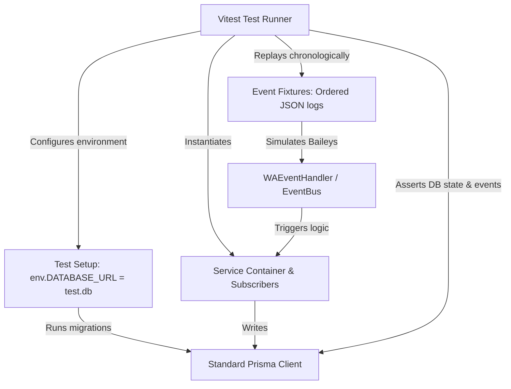
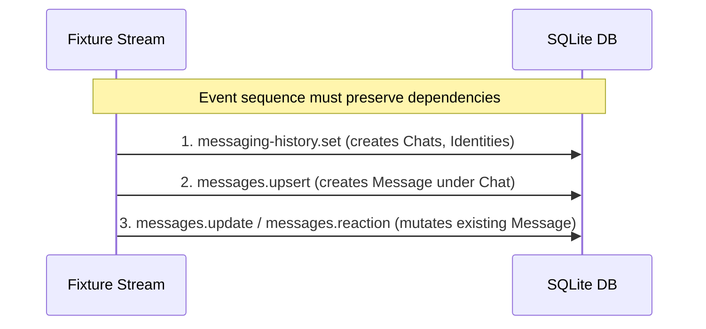

# SmartChat Integration & E2E Testing Implementation Plan

This document details the architectural design and execution strategy for implementing a comprehensive Integration and End-to-End (E2E) test suite for the SmartChat backend. The goal is to verify critical user journeys by replaying simulated WhatsApp/Baileys events against a clean test database and asserting correct database mutations, service orchestration, and domain event emissions.

---

## 1. Architectural Overview & Test Harness Design

To test the application's backend services without a live WhatsApp connection, we will build a **simulated event-driven test harness** around `WAEventBus` and `WAEventHandler`.

### 1.1 Test Stack Components



*   **Test Runner**: [Vitest](https://vitest.dev/) (already installed in `devDependencies`).
*   **Database Isolation**: A local, isolated SQLite database file (`prisma/test.db`) used exclusively for tests. We inject `process.env.DATABASE_URL = "file:./prisma/test.db"` dynamically during test setup.
*   **No Vector Extension Dependencies**: To keep the test suite lightweight and fast, semantic vector search is excluded. The native SQLite `sqlite-vec` extension will not be loaded, and the message embedding triggers will be fully stubbed.
*   **Simulated Socket (`WASocket`)**: Since we do not connect to live servers, we construct a type-safe stub of Baileys' `WASocket`. This stub mocks socket operations like `sendMessage`, `readMessages`, and `ev` listener hooks.
*   **Event Injection Pipeline**: We read events from the JSON test fixtures and feed them to `WAEventHandler` (mimicking the socket's `ev.process()` event loop). The handler parses the payloads, executes the services, and emits typed events on the `WAEventBus`, which are then processed by the active subscribers (e.g. `PersistenceSubscriber`).

---

## 2. Test Environment Setup & Configuration

We need to create the test infrastructure files within `smartchat/src/main/tests/` and configure Vitest to run them.

### 2.1 Vitest Configuration (`vitest.config.ts`)
We will place `vitest.config.ts` in the `smartchat` root to configure the testing environment, timeouts, and setup files.

```typescript
import { defineConfig } from 'vitest/config'
import { resolve } from 'path'

export default defineConfig({
  test: {
    globals: true,
    environment: 'node',
    setupFiles: ['./src/main/tests/setup.ts'],
    include: ['src/main/tests/**/*.test.ts'],
    testTimeout: 15000,
  },
  resolve: {
    alias: {
      '@': resolve(__dirname, './src')
    }
  }
})
```

### 2.2 Global Test Setup (`setup.ts`)
This file runs before the test suite starts. It initializes the database schema and manages cleanups.

```typescript
import { execSync } from 'child_process'
import { join } from 'path'
import { existsSync, unlinkSync } from 'fs'
import { PrismaClient } from '@prisma/client'

const dbPath = join(__dirname, '../../../../prisma/test.db')
process.env.DATABASE_URL = `file:${dbPath}`

let prismaTestClient: PrismaClient

beforeAll(async () => {
  // 1. Clean up old test db if present
  if (existsSync(dbPath)) {
    try { unlinkSync(dbPath) } catch {}
  }

  console.log('[Test Setup] Initializing clean SQLite test database...')
  
  // 2. Run Prisma push to create tables in the test db (excludes vector search table)
  execSync('npx prisma db push --accept-data-loss', { stdio: 'inherit' })

  prismaTestClient = new PrismaClient()
})

afterAll(async () => {
  if (prismaTestClient) {
    await prismaTestClient.$disconnect()
  }
  // Optional: remove test database file to leave workspace clean
  if (existsSync(dbPath)) {
    try { unlinkSync(dbPath) } catch {}
  }
})
```

---

## 3. Sequential Dependencies & Relational Integrity

Because our test database maintains foreign key constraints (e.g., `Message` requires a parent `Chat`; `Reaction` requires a parent `Message`; `ChatMember` requires both `Chat` and `Identity`), we must replay fixtures **chronologically** and satisfy relational dependencies:



### 3.1 Ordering Requirements
1.  **Backlog/History set first**: Any test simulating catchup or conversation context must first trigger `messaging-history.set` or seed the basic `Chat` and `Identity` models.
2.  **Message prior to Reaction/Edit/Delete**: You cannot edit or react to a message that does not exist in the database. Tests must process `messages.upsert` (creating the target message ID) before processing any `messages.update` or `messages.reaction` targeting that ID.

---

## 4. Critical User Journeys to Test

We will write integration tests targeting the five most critical workflows of the system:

### Journey 1: Backlog Synchronization (History Sync)
*   **Trigger Event**: `messaging-history.set`
*   **Flow**:
    1. A sync chunk containing history chats, messages, and contacts is received on socket connection.
    2. `HistorySyncManager` parses the chunk and processes data in batches.
    3. `SyncRepository` writes records to DB.
*   **Verification**:
    *   Verify that `Chat` rows are created with correct unread counts and JIDs.
    *   Verify that `Message` rows are properly linked to their respective chats.
    *   Verify that group memberships (`ChatMember`) are established and roles are correctly persisted.

### Journey 2: Real-time Message Upsert (Text, Media, Mentions)
*   **Trigger Event**: `messages.upsert` (handles BOTH types)
*   **Flow**:
    *   **`notify` type**: Real-time incoming messages. Processes individual messages sequentially, updating conversation timestamps, incrementing unread counters, and resolving display names.
    *   **`append` type**: Catch-up backlog sync messages. Persists messages in bulk batches first, then parses special messages (edits, deletes, reactions) in a secondary fast path.
*   **Verification**:
    *   Verify a new `Message` record exists in the database.
    *   Verify the sender's `Identity` and `IdentityAlias` are upserted.
    *   Verify the parent `Chat` record has its `timestamp` updated, and for `notify` type, `unreadCount` is correctly incremented.

### Journey 3: Message Deletes (Revokes) and Edits
*   **Trigger Event**: `messages.update` or `messages.upsert` (special protocol message)
*   **Flow**:
    1. A protocol message with type `REVOKE` or `MESSAGE_EDIT` is received.
    2. `MessageService` routes the update to the correct strategy.
    3. `PersistenceSubscriber` updates the existing message record.
*   **Verification**:
    *   For a Revoke: Verify the target message row has `isDeleted = true` and `textContent` sanitized.
    *   For an Edit: Verify the target message row has `isEdited = true` and `textContent` updated to the new content.

### Journey 4: Reactions Handling
*   **Trigger Event**: `messages.reaction`
*   **Flow**:
    1. A reaction payload (emoji + target message ID) arrives.
    2. `ReceiptSubscriber` / `ReactionRepository` creates or updates a reaction mapping.
*   **Verification**:
    *   Verify a row is created in the `Reaction` table mapped to the message.
    *   Verify the reaction emoji matches the payload.
    *   Verify that sending a blank/empty reaction emoji removes the database entry (un-reaction).

### Journey 5: Identity Reconciliation (LID / PN Mapping)
*   **Trigger Event**: `lid-mapping.update` or inline message metadata containing LID/PN linkages
*   **Flow**:
    1. The client receives updates connecting a Phone Number (`@s.whatsapp.net`) and a Linked ID (`@lid`).
    2. `ContactService` / `ContactGroupSubscriber` links the aliases under one canonical `Identity`.
*   **Verification**:
    *   Verify that only one `Identity` row exists for the individual.
    *   Verify that two aliases (`PN` and `LID`) are attached to that `Identity`.
    *   Verify that query queries prioritizing LIDs function correctly and return the canonical identity.

---

## 5. Test Fixture Management & Extraction

We have two strategies for managing our test data:

1.  **Compact Preset Fixtures**: Use `wa_events_test_fixture.json` (already checked in at ~8MB), which contains 34 pre-filtered, chronologically ordered logs covering history sets, upserts, deletes, reactions, and receipts.
2.  **On-Demand Slice Extraction**: For new scenarios, we run the newly created `extract_fixtures.js` utility to pull slices of interest from the large daily logs:
    ```bash
    # Extract the first 5 real-time message upserts from May 17th
    node dev_only/logs/extract_fixtures.js --event=messages.upsert --limit=5
    ```

---

## 6. Mocking Strategy & Stubs

To avoid importing heavy OS dependencies or spinning up asynchronous background workers, the test harness will configure selective mocks:

> [!TIP]
> Keep your mocks lightweight. Mock only the transport and OS-boundary files, while executing the raw, unmodified business logic of services and repositories.

```typescript
// 1. Mocking Electron Window and Broadcasts
const mockWindow = {
  webContents: {
    send: vi.fn() // Capture UI updates for assertion
  }
}
const getMainWindow = () => mockWindow as any

// 2. Mocking AI Embeddings Service entirely
vi.mock('../services/search/EmbeddingService', () => {
  return {
    EmbeddingService: class MockEmbeddingService {
      public async queueMessageForEmbedding() { return Promise.resolve() }
      public async syncVectors() { return Promise.resolve() }
    }
  }
})

// 3. Mock WASocket Stub
const createMockSocket = () => ({
  ev: {
    on: vi.fn(),
    off: vi.fn(),
    process: vi.fn()
  },
  sendMessage: vi.fn().mockResolvedValue({ key: { id: 'test-sent-id' } })
})
```

---

## 7. Execution Milestones & Step-by-Step Roadmap

We will implement the test harness in three progressive milestones:

### Milestone 1: Environment Configuration & Basic Setup
*   [x] Add the `"test": "vitest"` script to package.json.
*   [x] Create `vitest.config.ts` and `src/main/tests/setup.ts` to configure the test database file, run migrations, and register cleanup hooks.
*   [x] Add a `basic.test.ts` to confirm database connectivity, database resets, and basic operations.

### Milestone 2: Event Injection and Synchronization Test
*   [x] Create `src/main/tests/helpers.ts` containing the `createMockSocket`, service container instantiator, and test event injector.
*   [x] Write the **Backlog Synchronization Test** using the `messaging-history.set` fixtures to verify bulk database insertion.
*   [x] Write the **Real-time Message Upsert Test** (`messages.upsert`) to verify text indexing, chat list mutations, and unread counters.

### Milestone 3: Advanced Messaging, Reactions, and ID Reconciliation
*   [x] Write tests for **Message Revokes and Edits** to verify state flags on existing rows.
*   [x] Write tests for **Reactions** (add, update, remove).
*   [x] Write tests for **LID / PN mapping** and verify the database prevents identity pollution and keeps aliases aligned.
*   [x] Run the full test suite (`npm run test`) and verify 100% pass rates.
